# 5 étapes faciles pour débuter avec Meow Money Manager
Gérez vos finances simplement et agréablement. Meow Money Manager propose une interface chat mignonne et des outils performants. Suivez ces 5 étapes.

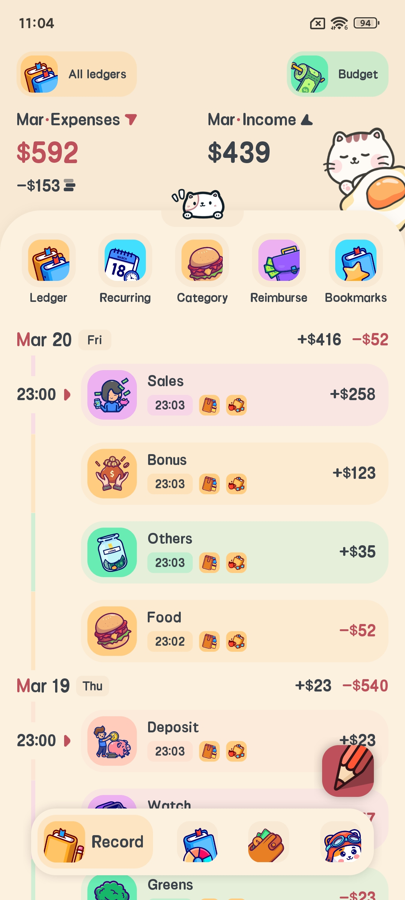 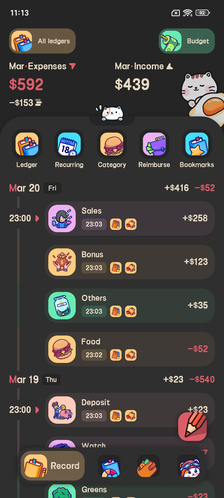 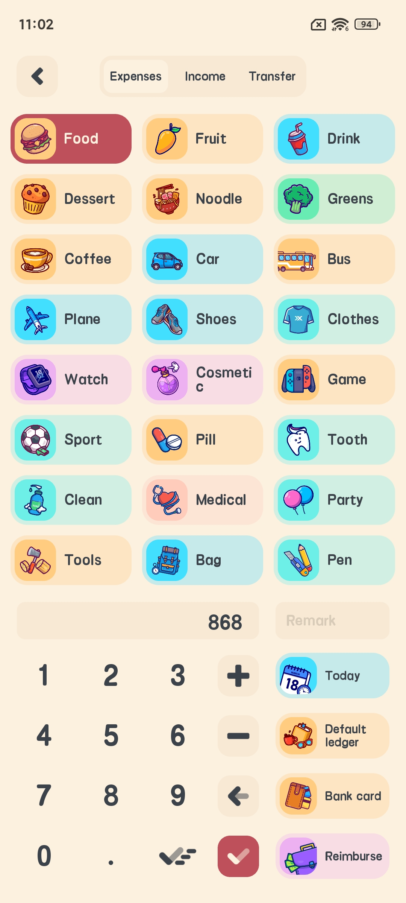 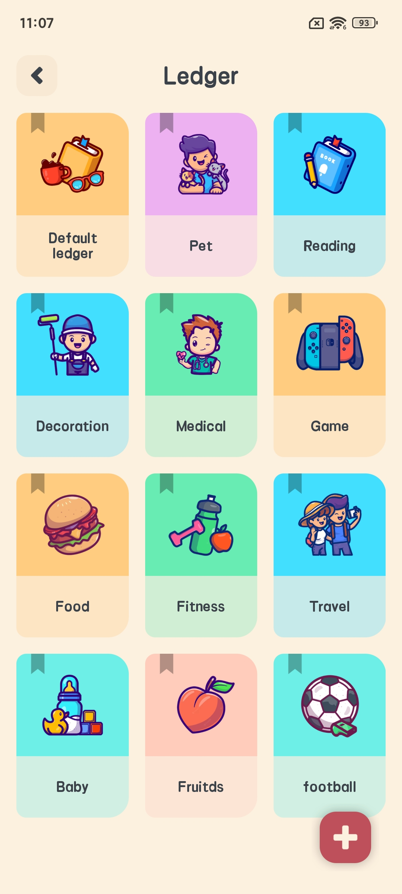 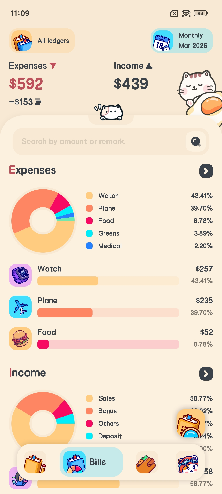

### Étape 1 : Télécharger et installer
Téléchargez depuis [Google Play](https://play.google.com/store/apps/details?id=com.glgjing.money.manager.bookkeeping.meow) ou [App Store](https://apps.apple.com/us/app/meow-money-manager/id1528852284). Compatible Android et iOS.

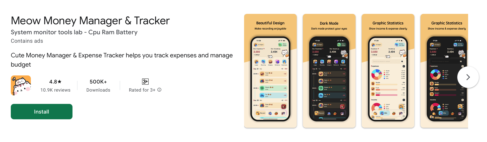

### Étape 2 : Créer votre premier carnet comptable
Ouvrez l’appli et créez un carnet nommé « Dépenses personnelles ». Utilisez plusieurs carnets pour séparer vos finances.

 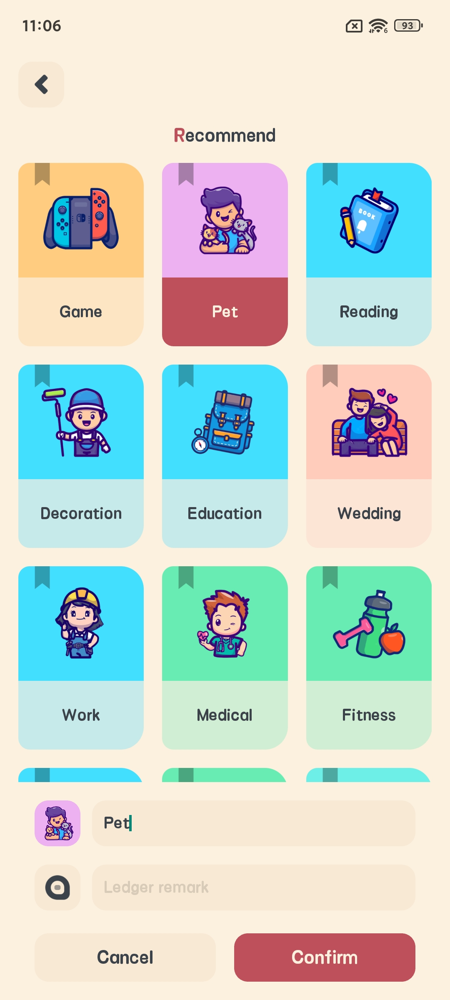 

### Étape 3 : Personnaliser votre budget
Définissez un budget journalier, hebdomadaire ou mensuel par catégorie (repas, transports). L’appli vous alerte avant la limite.

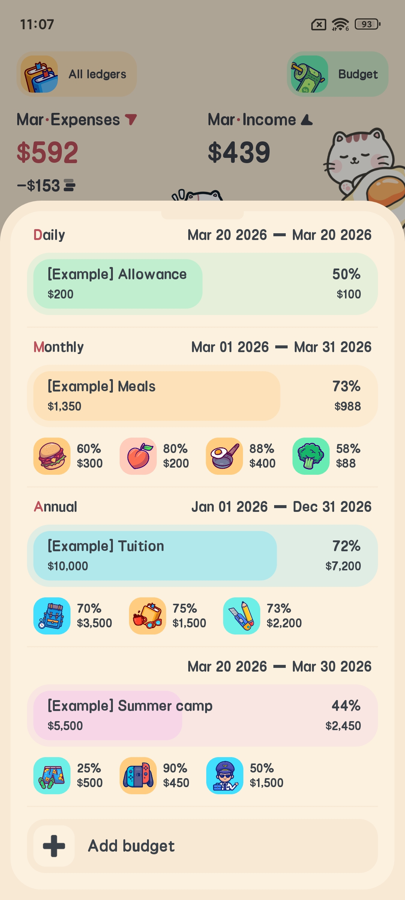 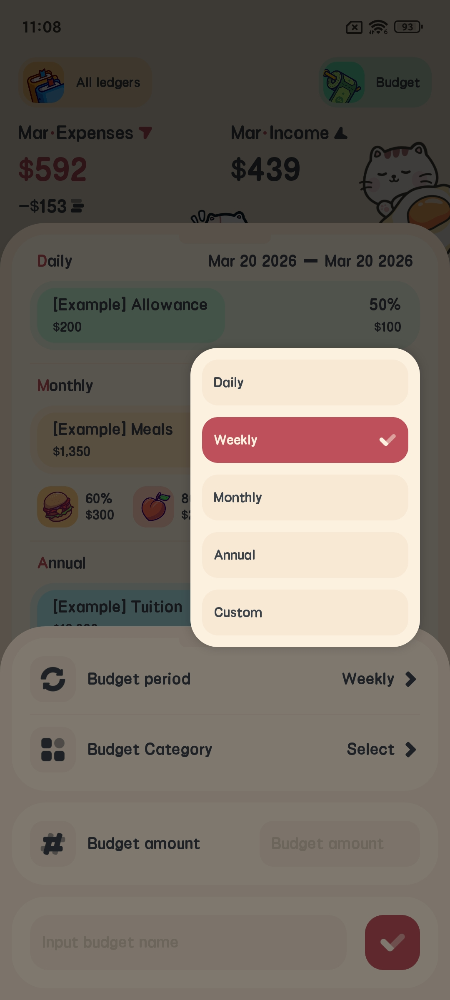 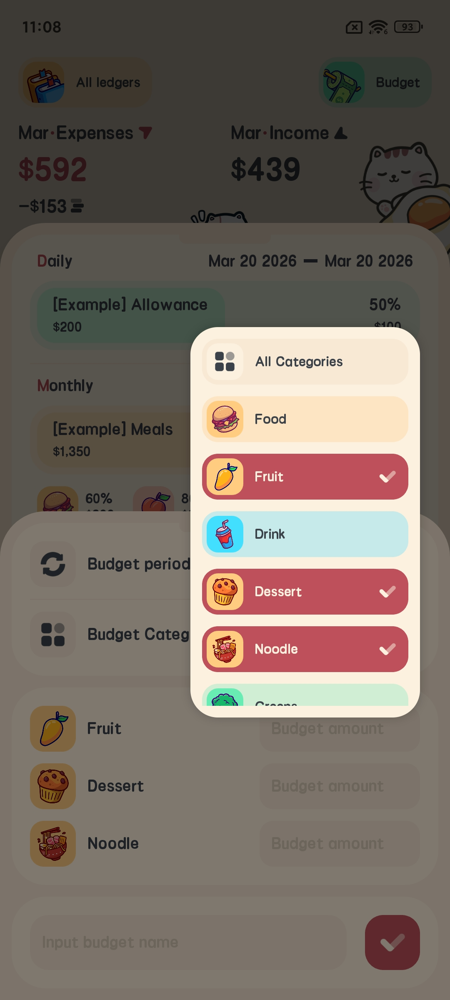 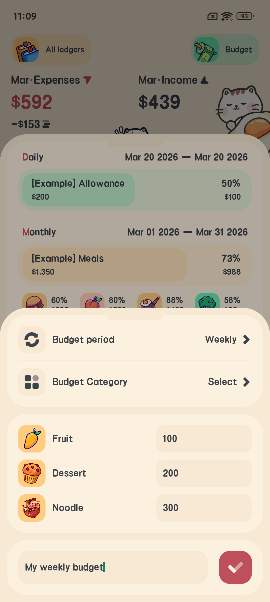

### Étape 4 : Enregistrer revenu ou dépense
Appuyez sur « + », choisissez le type, une icône parmi 500, le montant et une note. Configurez des entrées récurrentes pour le loyer et le salaire.

### Étape 5 : Consulter statistiques & protéger vos données
Affichez graphiques et calendrier. Activez mot de passe ou empreinte digitale. Sauvegardez sur iCloud/WebDAV et exportez en CSV.

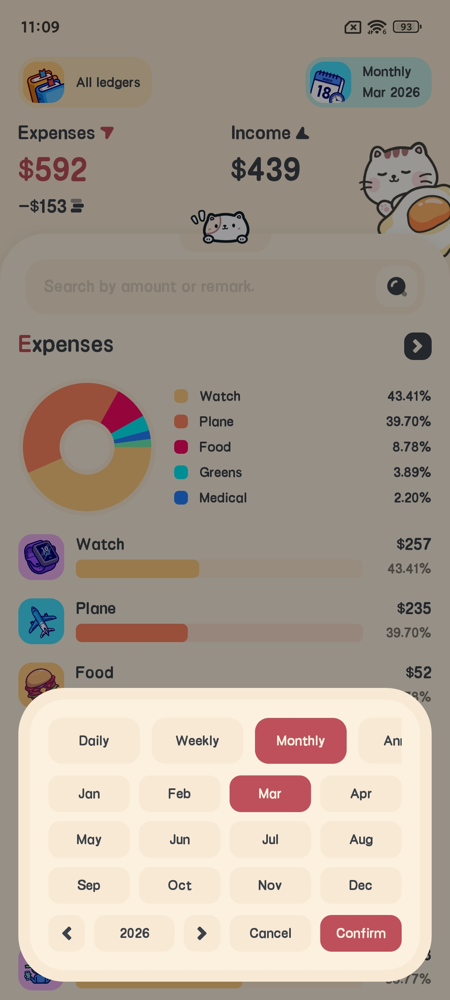
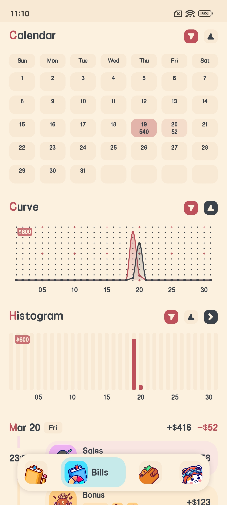
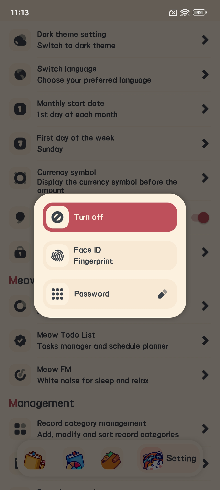
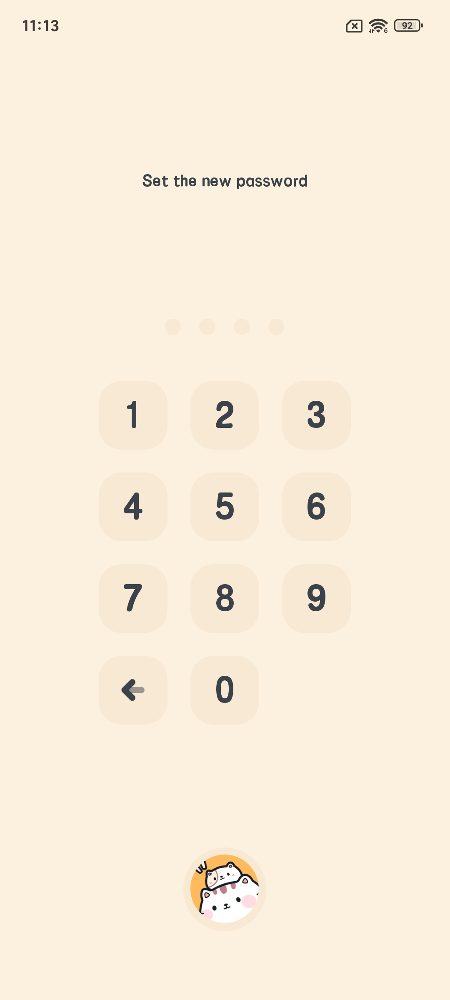

Très simple ! L’appli est gratuite, abonnez-vous pour les fonctions premium. Téléchargez-la aujourd’hui.
